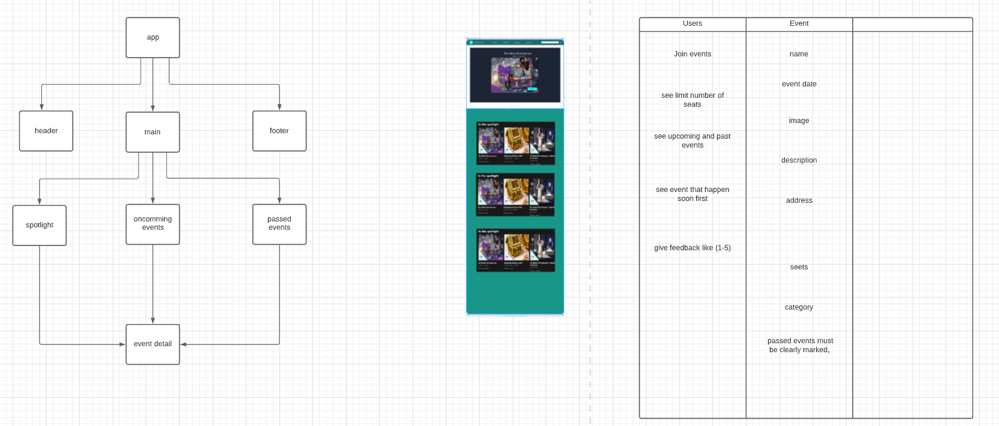

# Meet-up application

En Meetup är en sammankomst för personer med ett gemensamt intresse. Det kan handla om platsbundna eller online evenemang. En meetup kan ha ett begränsat antal platser. Din uppgift är att göra en webbapp där besökare kan anmäla sig till evenemang. Förutom detta ska besökare kunna se kommande och passerade evenemang, diskutera och rejta dem, samt lägga upp egna.

## User stories

* Som användare vill jag se en Hero event som ska promotas extra.

* Som användare vill jag se alla meetups.

* Som en besökare vill jag se meetups som inträffar från längst fram i tiden till längst back i tiden, därför att de är mest intressanta för mig.

* Som användare vill jag ha möjligheten att anmäla mig till kommande meetups därför att jag vill delta på de som för mig är relevanta.

* Som en besökare vill jag att passerade meetups ska markeras tydligt, så att jag inte försöker anmäla mig till något som redan har varit.

* Som besökare vill jag kunna kommentera evenemang.

##  instruktionerna

https://docs.google.com/document/d/136DTDYFeX-N2n4-fI_kryrc2Fv1--wSA-94aIAdNDJE/edit#heading=h.vmdgce6r6o3e

## UML case-diagram

[Link to case diagram](https://lucid.app/lucidchart/7522aba1-139b-4b94-acb8-015dbe84daf8/edit?beaconFlowId=B0803775808E960D&invitationId=inv_e0df05e9-09e2-4fd9-afed-b7b71b6b3f7e&page=0_0#)
